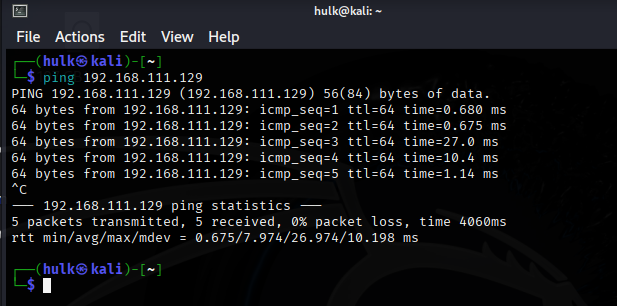
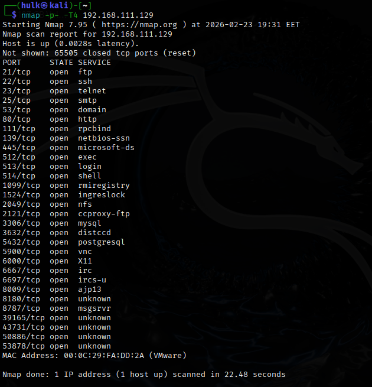
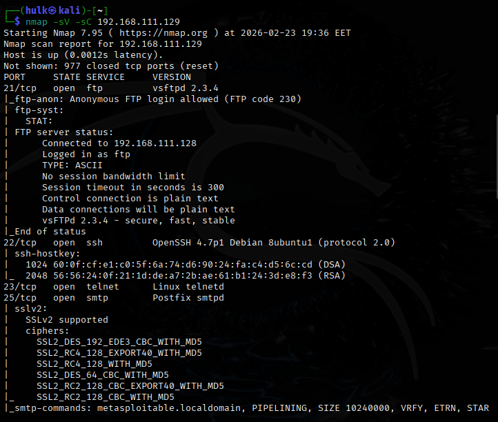
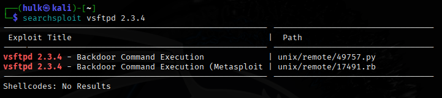
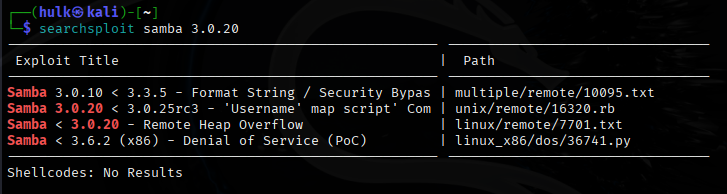
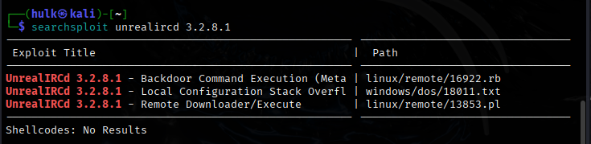

# \# Advanced Network Security Assessment Report

# &nbsp; 

\## Target: Metasploitable2  

\## Assessor: Ehab Ayman Anwar  

\## Environment: Isolated Lab (VMware Host-Only Network)

---

#### **# 1. Executive Summary**

A penetration testing assessment was conducted against the Metasploitable2 vulnerable machine in a controlled lab environment.  

The objective was to identify exposed services, detect outdated software versions, map known vulnerabilities (CVEs), and assess overall system risk.

The assessment revealed multiple critical remote code execution vulnerabilities that could allow full system compromise.

---

#### **# 2. Scope**

Target IP: 192.168.111.129  

Testing Type: Internal Lab Assessment  

Tools Used: Nmap, Searchsploit  

---

#### **# 3. Methodology**

**(1) Host discovery:**

code: ping 192.168.111.129

###### **(2) Full Port Enumeration:**

code: nmap -p- -T4 192.168.111.129

A full TCP port scan was conducted using Nmap to identify all open ports on the target machine.The scan revealed multiple open services including FTP (21), SSH (22), Telnet (23), HTTP (80), SMB (445), MySQL (3306), and VNC (5900), indicating a significantly exposed attack surface.

###### **(3) Service \& version detection:**

code: nmap -sV -sC 192.168.111.129

.png)
.png)
.png)

The scan revealed several outdated and vulnerable services including:

vsftpd 2.3.4 (Anonymous FTP enabled)

Samba 3.0.20

Apache 2.2.8

MySQL 5.0.51a

UnrealIRCd 3.2.8.1

Multiple services were found running outdated versions known to contain publicly disclosed vulnerabilities.

###### **(4) Vulnerability research:**

code: searchsploit vsftpd 2.3.4

code: searchsploit samba 3.0.20

code: searchsploit unrealircd 3.2.8.1

Using Searchsploit, publicly available exploits were identified for several services:

**vsftpd 2.3.4**

* CVE-2011-2523
* Backdoor allowing remote command execution

**Samba 3.0.20**

* Remote Heap Overflow
* Username Map Script Command Execution

**UnrealIRCd 3.2.8.1**

* Backdoor Command Execution
* Remote Code Execution

The presence of these exploits confirms that the target system is highly vulnerable and susceptible to remote compromise.

###### **(5) CVE mapping**

vsftpd 2.3.4 ==> CVE: CVE-2011-2523

UnrealIRCd 3.2.8.1 ==> CVE: CVE-2010-2075

Samba 3.0.20 ==> CVE: CVE-2007-2447

---

#### **# 4. Findings**

**## 4.1 vsftpd 2.3.4**

\- Vulnerability: Backdoor Remote Code Execution  

\- CVE: CVE-2011-2523  

\- Severity: Critical  

**## 4.2 UnrealIRCd 3.2.8.1**

\- Vulnerability: Backdoor Command Execution  

\- CVE: CVE-2010-2075  

\- Severity: Critical  

**## 4.3 Samba 3.0.20**

\- Vulnerability: Remote Code Execution  

\- Severity: High  

---

#### **# 5. Risk Assessment**

The system is highly vulnerable due to multiple exposed services running outdated software versions.  

An attacker could gain remote shell access and fully compromise the machine.

---

#### **# 6. Recommendations**

* Immediately remove UnrealIRCd 3.2.8.1.
* Upgrade to a clean and verified version.
* Validate software integrity using checksums.
* Restrict access to IRC service if not required.
* Monitor unusual outbound connections.
* Implement host-based intrusion detection.

---

#### **# 7. Conclusion**

The assessment confirms that the target system is intentionally vulnerable.  

Immediate remediation would be required in a real-world environment.

